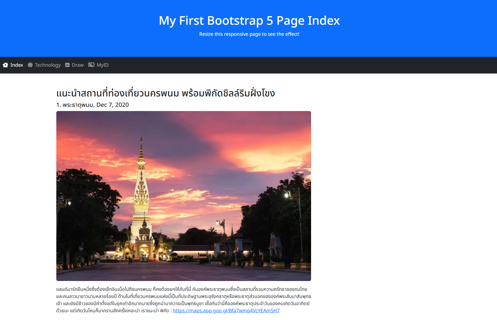

# 🚀 CT526-0239
Assingmernt 
ให้นักศึกษา สร้างเครื่องให้บริการเว็บอย่างง่ายด้วย Python Flask โดยประกอบด้วย
   - พาธ /  หน้าเว็บแนะนำสถานที่่ท่องเที่ยวมา สัก 1 ที่
   - พาธ   /tech หน้าเว็บแสดงข้อมูลเทคโนโลยีที่ตนเองสนใจ
   - พาธ   /myid   แสดงเลขรหัสนักศึกษาของตนเอง (ไม่ต้องเป็นหน้าเว็บ)
   - พาธ  /draw/3 แสดงการเรียง xxxx ของงาน Git ครั้งที่แล้ว จำนวน 3 แถว  ทั้งนี้ เปลี่ยนเลข 3 เป็นเลขอื่นได้

สิ่งที่ต้องส่ง   ลิ้ง บน GitHub  แต่ว่า ช่วยเขียน README.md แสดงขั้นตอนการสร้าง หรือหลักการที่ใช้ในการสร้างเว็บ ด้วย Flask

---

## 📑 Table of Contents
- [About the Project](#about-the-project)
- [Features](#features)
- [Installation](#installation)
- [Usage](#usage)
- [Screenshots](#screenshots)

---

## About the Project
Flask คือ Web Framework แบบ Lightweight (microframework)
ใช้สำหรับสร้างเว็บแอป (Web App / API) ด้วยภาษา Python

มันทำหน้าที่เป็น “ตัวกลาง” ระหว่าง ผู้ใช้ (browser) กับ โค้ด Python ของเรา
โดย Flask จะจัดการเรื่อง:

การรับคำขอจากผู้ใช้ (Request)
การตอบกลับข้อมูล (Response)
เส้นทาง (Route) หรือ URL ของเว็บ

โดยมีกระบวนการดังนี้ 
- เมื่อสั่งให้ app.py ทำงาน ชุดคำสั่งจะสร้างเว็บแอป ให้เรียกใช้งาน
- เมื่อใช้งานเรียก Route ที่ได้กำหนดไว้ python จะดำเนินการตามชุดคำสั่งที่เขียนไว้ใน Route ดังกล่าว
- จากนั้นเว็บแอป จะส่งผลลัพย์กลับมาที่ Web Browser ของผู้ใช้งาน

---

## Features
- สามารถสร้างเว็บไซต์ให้บริการแบบเล็กๆได้
- สามารถกำหนด Route เพื่อให้แสดงผลหน้าต่างๆ ได้
- สามารถประมวลผลตามชุดคำสั่ง และแสดงผลที่หน้า Web Browser ได้

---

## Installation

### Clone the repository
    git clone https://github.com/khmkhns23/CT526_0239_Simple_Flask.git

---

## Usage

### Go inside the folder
    cd CT526-0239_Simple_Flask

### การเรียกใช้งานโปรแกรม ด้วยคำสั่งด้านล่างนี้
    python3 app.py

---

## Screenshots

  

